# 事件流程图（序章 + 第一章）

> 创建日期：2026-05-30
> 范围：demo 切片全部事件触发顺序，作为对话脚本编排和 cutscene runner 的总图。
> 关联：[NPC 数据表](npc-data-spec.md)、[属性变量定义-spec.md](属性变量定义-spec.md)、[元生六年级故事线](../reference/元生六年级故事线.md)

---

## 一、序章 · 二楼的窗

### 总流程

```mermaid
flowchart TD
    Start([新游戏]) --> Title[章节标题卡<br/>序章 · 二楼的窗]
    Title --> Home[家中场景<br/>scene: home]
    Home --> P01[01_father_send_off<br/>父亲送行 cutscene]
    P01 --> Mountain[山路场景<br/>scene: mountain_road_autumn]
    Mountain --> P01b[父亲送到山路口告别<br/>'周五自己回']
    P01b --> Gate[校门场景<br/>scene: school_gate]
    Gate --> Corridor1[走廊场景<br/>scene: corridor_stairs]
    Corridor1 --> P03[03_corridor_overhear<br/>听见老师议论<br/>kaguodu_xinli +1]
    P03 --> Cls[二班教室<br/>scene: classroom_2b]
    Cls --> P02[02_classroom_arrival<br/>分到二班 / 班会 / 鲍先进点曾建明做班长]
    P02 --> Choice1{要不要主动报全名?}
    Choice1 -->|主动报| KC1[koucai +1]
    Choice1 -->|不主动| Skip1[ ]
    KC1 --> Xmb[小卖部场景<br/>scene: xiaomaibu]
    Skip1 --> Xmb
    Xmb --> P04[04_xiaomaibu_first_pass<br/>王炎买辣条 / 元生路过<br/>qianbao_xiuchi +1]
    P04 --> Dorm[男生宿舍场景<br/>scene: dorm]
    Dorm --> P05[05_dorm_assigned<br/>宿舍分铺 cutscene<br/>主角上铺 / 王炎下铺 /<br/>曾建明斜对面上铺 / 曹正东下铺]
    P05 --> Choice2{主动跟王炎打招呼?}
    Choice2 -->|是| Aff1[affinity_wangyan +1<br/>koucai +1]
    Choice2 -->|否| Skip2[ ]
    Aff1 --> Save[二班靠窗第三排<br/>解锁存档点]
    Skip2 --> Save
    Save --> Era[era_marker: kaixue]
    Era --> ChEnd([序章结束<br/>set_chapter ch1])
```

### 序章触发顺序（线性）

| 序号 | event_id | 场景 | 触发方式 | 关键变更 |
|---|---|---|---|---|
| 1 | — | `home` | 自动（章节开始）| current_chapter=prologue / 道具 4 件入袋 |
| 2 | `prologue/01_father_send_off` | `home` → `mountain_road_autumn` | 自动 cutscene | affinity_fuqin 可选 +1（选项）|
| 3 | — | `school_gate` | 走过门 | — |
| 4 | `prologue/03_corridor_overhear` | `corridor_stairs` | 走过走廊一定坐标 | kaguodu_xinli +1 |
| 5 | `prologue/02_classroom_arrival` | `classroom_2b` | 到教室坐下 | era_marker: kaixue / koucai 可选 +1 |
| 6 | `prologue/04_xiaomaibu_first_pass` | `xiaomaibu` | 走过门口（不进店）| qianbao_xiuchi +1 |
| 7 | `prologue/05_dorm_assigned` | `dorm` | 进宿舍 | affinity_wangyan 可选 +1 / koucai 可选 +1 |
| 8 | — | `classroom_2b`（第三排）| 走到座位 | 解锁存档点 / chapter=ch1 |

---

## 二、第一章 · 蒸饭盒里的秋天

### 总流程

```mermaid
flowchart TD
    Start([序章结束]) --> Title[章节标题卡<br/>第一章 · 蒸饭盒里的秋天]
    Title --> M11[食堂蒸饭间<br/>11_zhengfanhe_help]
    M11 --> M11b[王炎帮认饭盒]
    M11b --> Choice1{说谢谢?}
    Choice1 -->|是| Aff1[affinity_wangyan +1<br/>koucai +1]
    Choice1 -->|否| Skip1[ ]
    Aff1 --> M12[走廊场景<br/>12_yuekao_ranking]
    Skip1 --> M12
    M12 --> M12a[鲍先进念分数 cutscene]
    M12a --> M12b[元生看排名表 / 站两米外]
    M12b --> M12c[曾建明从胡晓东那边过来 / 上二楼]
    M12c --> M12d[xinjie +1<br/>xuexi +1]
    M12d --> M13[小卖部<br/>13_xiaomaibu_first_buy]
    M13 --> Choice2{选项}
    Choice2 -->|A 摇头不要| AA[qianbao_xiuchi +1]
    Choice2 -->|B 赊账辣条| BB[xinjie +1]
    Choice2 -->|C 买 2 毛跳跳糖| CC[affinity_baosimu +1<br/>koucai +1]
    AA --> M14
    BB --> M14
    CC --> M14
    M14[楼梯口<br/>14_caozhengdong_robbery] --> M14a[曹正东拦截 cutscene]
    M14a --> Choice3{选项}
    Choice3 -->|A 不吭声| AAA[danliang -1<br/>affinity_caozhengdong -1<br/>xinjie +2<br/>qianbao_xiuchi +2]
    Choice3 -->|B 喊老师| BBB[danliang +1<br/>affinity_baoxianjin +1<br/>affinity_caozhengdong -2<br/>xinjie +1]
    Choice3 -->|C 推回去 needs danliang≥3| CCC[danliang +2<br/>触发隐藏硬刚分支]
    AAA --> M15
    BBB --> M15
    CCC --> M15
    M15[二班教室晚自习<br/>15_shenzhou7_evening] --> M15a[全班看翟志刚出舱]
    M15a --> M15b[王炎问'你以后想干啥?']
    M15b --> M15c[曾建明回头说一句]
    M15c --> Choice4{回应?}
    Choice4 -->|是| Aff2[affinity_zengjianming +1]
    Choice4 -->|否| Skip2[ ]
    Aff2 --> M15d[era_marker: shenzhou7]
    Skip2 --> M15d
    M15d --> M16[班会场景<br/>16_sanlu_classmeeting]
    M16 --> M16a[鲍先进讲奶粉事件]
    M16a --> M16b[晚自习后路过校门]
    M16b --> M16c[门卫大爷讲'城里出大事了']
    M16c --> Choice5{要不要听完?}
    Choice5 -->|是| Aff3[affinity_menwei_daye +1]
    Choice5 -->|否| Skip3[ ]
    Aff3 --> M16d[era_marker: sanlu]
    Skip3 --> M16d
    M16d --> Sub{支线选择<br/>可选}
    Sub --> S1[姐姐的信<br/>宿舍存档点重读]
    Sub --> S2[曾建明的橡皮<br/>数学课]
    Sub --> S3[直接结束第一章]
    S1 --> ChEnd
    S2 --> Aff4[affinity_zengjianming +1] --> ChEnd
    S3 --> ChEnd
    ChEnd([第一章结束<br/>set_chapter ch1_done<br/>Demo 终幕])
```

### 第一章触发顺序

| 序号 | event_id | 场景 | 触发方式 | 关键变更 |
|---|---|---|---|---|
| 1 | `ch1/11_zhengfanhe_help` | `cafeteria_steam` | 自动 cutscene（进入蒸饭间）| affinity_wangyan 可选 +1 |
| 2 | `ch1/12_yuekao_ranking` | `corridor_stairs` | 自动 cutscene | xinjie +1 / xuexi +1 |
| 3 | `ch1/13_xiaomaibu_first_buy` | `xiaomaibu` | 自动 cutscene（王炎拉进店）| 选项分支：A/B/C 不同 |
| 4 | `ch1/14_caozhengdong_robbery` | `corridor_stairs` | 自动 cutscene | 选项分支：A/B/C 不同 |
| 5 | `ch1/15_shenzhou7_evening` | `classroom_2b` | 自动 cutscene（晚自习）| era_marker: shenzhou7 |
| 6 | `ch1/16_sanlu_classmeeting` | `classroom_2b` → `school_gate` | 自动 cutscene | era_marker: sanlu |
| 7 | （支线）| 多场景 | 主角主动 interact | 见上图 |
| 8 | — | 任意 | 走回二班存档点 | chapter=ch1_done / Demo 结束 |

---

## 三、Demo 终幕

第一章 1.6 完成后，玩家可以选择：

1. 跑剩下的支线（姐姐的信、曾建明的橡皮、咸菜外交）
2. 直接走回二班靠窗第三排存档点 → 触发"Demo 试玩结束"画面 → 显示属性面板 + 时代切片墙 + "Demo · 序章 + 第一章 完结。"

---

## 四、Demo 不实现的分支

为避免范围蔓延，下面这些分支在 demo 不接：

- "硬刚"路线（1.4 选项 C）后续连锁——demo 只记录变量，不展开后续叙事
- 第一章 1.5 王炎"你以后想干啥"的"敢说"分支——demo 默认元生不答
- 第二章及以后的全部内容
- 带战斗的 1.4 替代分支
